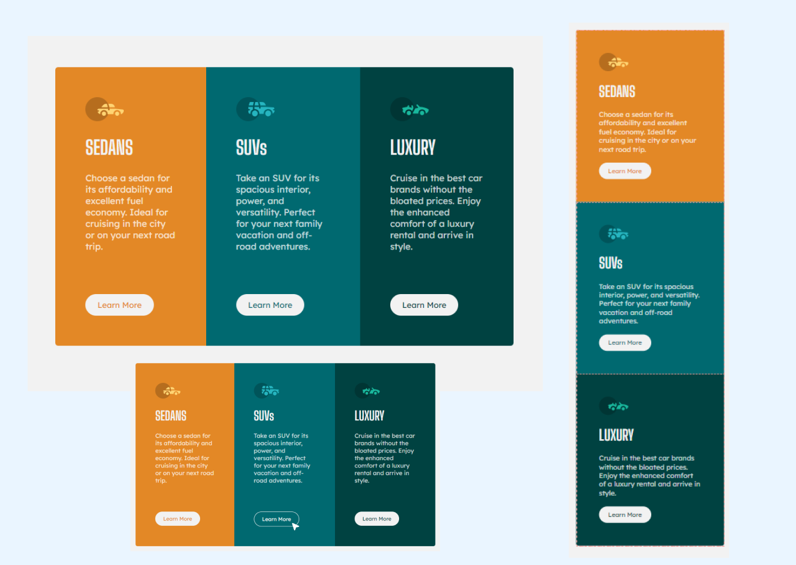

# Frontend Mentor - 3-column preview card component solution

This is a solution to the [3-column preview card component challenge on Frontend Mentor](https://www.frontendmentor.io/challenges/3column-preview-card-component-pH92eAR2-). Frontend Mentor challenges help you improve your coding skills by building realistic projects. 

## Table of contents

- [Overview](#overview)
  - [The challenge](#the-challenge)
  - [Screenshot](#screenshot)
  - [Links](#links)
- [My process](#my-process)
  - [Built with](#built-with)
  - [What I learned](#what-i-learned)
  - [Useful resources](#useful-resources)
- [Author](#author)


## Overview

### The challenge

Users should be able to:

- View the optimal layout depending on their device's screen size
- See hover states for interactive elements

### Screenshot of the solution




### Links

- Solution URL: https://ritakerkovits.github.io/3-column-preview-card-component-main/

## My process

### Built with

- Semantic HTML5 markup
- CSS custom properties
- Flexbox
- Mobile-first workflow
- Figma 


### What I learned


- I gained a better knoledge to utilize the flex property

Example of the code:
```css
    .sedan .suv .luxury{
        flex: 1 1 40%;
        align-items: center;
    }
```

- Tried another appeoach of setting the colors using hsl and hsla color picker

Example of the code:
```css
.sedan{
    background-color: hsl(31, 77%, 52%);
}

.suv{
    background-color: hsl(184, 100%, 22%);
}

.luxury{
    background-color: hsl(179, 100%, 13%);
}
```


### Useful resources

- **Understanding Flex property** - _https://www.youtube.com/watch?v=sanswTlz4ZY&list=PL-oX2VRTbbqiEji3edl_T1gF4pPATVAsm&index=7_ - This video helped me to gain a profound understanding of flex-basis, flex-grow and flex-shrink.


## Author

- Frontend Mentor - _[https://www.frontendmentor.io/profile/ritakerkovits]_


